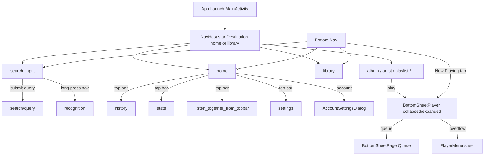
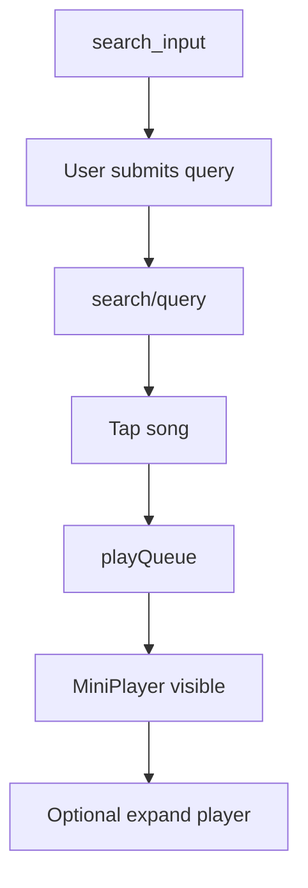

# Product UX/UI Specification

**Repository:** `roofy-music-mobile`  
**Document scope:** Android client only (Kotlin, Jetpack Compose, Navigation Compose).  
**Last audited from code:** 2026-06-02  
**Method:** File-level audit of routing, screens, components, themes, manifests, and navigation handlers. Uncertainties are marked `Unclear from code`.

---

## 1. Overview

### App purpose

Roofy Music is a **native Android music client** (fork/evolution of Metrolist) that streams and plays content from **YouTube Music** via InnerTube, with local library storage (Room), offline downloads, lyrics, social listening, desktop pairing, and extensive playback/settings controls. The README describes it as “a premium music experience for Android.”

### Main user types (identifiable from code)

| User type | Evidence |
| --------- | -------- |
| **Anonymous / visitor** | Playback and browse without `InnerTubeCookieKey` login; visitor data preferences exist. |
| **Logged-in YouTube Music user** | `LoginScreen` + cookie/account prefs; sync of likes, playlists, account avatar on home. |
| **Power / tinkerer** | Settings for EQ, AI lyrics, backup, integrations, updater, Android Auto. |
| **Social listener** | Listen Together rooms (`ListenTogetherScreen`, deep links). |
| **Desktop ecosystem user** | `link_computer`, `roofymusic://pair/*`, desktop import, “Listen on” device sheet. |

### Main functional areas

- **Home & discovery** — personalized shelves, charts, moods, wrapped, new releases.
- **Search** — online + local DB search, URL parsing, recognition entry.
- **Library** — mix view, playlists, songs, albums, artists, podcasts (local + online).
- **Playback** — persistent mini player + expandable bottom-sheet player, queue, lyrics, Cast (GMS builds).
- **Settings & account** — appearance, content, player, storage, privacy, integrations.
- **Recognition** — ShazamKit-based identify + history + desktop import queue.
- **Stats / history / wrapped** — listening analytics and year-in-review flow.

### Main navigation model

- **Single-activity** app: `MainActivity` hosts a `NavHost` plus **global overlays** (player bottom sheet, context menus, account dialog, changelog).
- **Bottom navigation (portrait)** or **navigation rail (landscape)**: Home, Search, Library, Now Playing (player tab does not change route; expands player sheet).
- **Stack navigation** for detail screens (album, artist, playlists, settings sub-pages).
- **Modal layers**: `BottomSheetMenu` (`LocalMenuState`), `BottomSheetPage` (`LocalBottomSheetPageState`), Compose `Dialog`s, Material `ModalBottomSheet` in menu component.

### Platforms supported

| Platform | Supported |
| -------- | --------- |
| **Android phone** | Yes — primary; min SDK 21 per README. |
| **Android tablet / large width** | Yes — landscape uses `AppNavigationRail` (84dp). |
| **Android TV (Leanback)** | Partial — `LEANBACK_LAUNCHER` in manifest; `Unclear from code` how TV-specific UX differs beyond launcher entry. |
| **Android Auto** | Yes — `AndroidAutoSettings`, `MediaLibrarySessionCallback`, Gearhead package check. |
| **Desktop / web** | No native UI in this repo; pairing/import via deep links only. |

---

## 2. App Architecture Relevant to UX

| Area | File/Folder | Purpose |
| ---- | ----------- | ------- |
| Application entry | `roofy-music-mobile/app/src/main/kotlin/com/metrolist/music/App.kt` | Hilt app, global init `Unclear from code` without reading full file. |
| Main UI shell | `roofy-music-mobile/app/src/main/kotlin/com/metrolist/music/MainActivity.kt` | Compose `setContent`, `NavHost`, scaffold top bar, bottom bar/rail, player sheet, dialogs, intent/deep-link routing. |
| Route registration | `roofy-music-mobile/app/src/main/kotlin/com/metrolist/music/ui/screens/NavigationBuilder.kt` | All `composable(...)` destinations. |
| Bottom nav route defs | `roofy-music-mobile/app/src/main/kotlin/com/metrolist/music/ui/screens/Screens.kt` | Tab routes and icons; `MainScreens` list. |
| Navigation chrome | `roofy-music-mobile/app/src/main/kotlin/com/metrolist/music/ui/component/AppNavigation.kt` | `AppNavigationBar`, `AppNavigationRail`, selection + search long-press. |
| Player overlay | `roofy-music-mobile/app/src/main/kotlin/com/metrolist/music/ui/player/Player.kt`, `MiniPlayer.kt`, `Queue.kt` | Bottom-sheet player, mini player, queue page. |
| Context menus | `roofy-music-mobile/app/src/main/kotlin/com/metrolist/music/ui/menu/*` | Song/album/playlist/player menus. |
| Menu host | `roofy-music-mobile/app/src/main/kotlin/com/metrolist/music/ui/component/BottomSheetMenu.kt`, `Menu.kt` | `LocalMenuState` modal bottom sheets. |
| Secondary sheet host | `roofy-music-mobile/app/src/main/kotlin/com/metrolist/music/ui/component/BottomSheetPage.kt` | Stacked “pages” (e.g. queue) on player. |
| Screens | `roofy-music-mobile/app/src/main/kotlin/com/metrolist/music/ui/screens/**` | Feature screens. |
| Shared UI | `roofy-music-mobile/app/src/main/kotlin/com/metrolist/music/ui/component/**` | Lists, lyrics, dialogs, shimmer, preferences. |
| Devices / Cast | `roofy-music-mobile/app/src/main/kotlin/com/metrolist/music/ui/devices/**` | Listen On sheet, web control; Cast in `app/src/gms` flavor. |
| Theme / design tokens | `roofy-music-mobile/app/src/main/kotlin/com/metrolist/music/ui/theme/RetroTheme.kt`, `Theme.kt`, `Type.kt` | Retro monochrome design system + Material3 scheme. |
| Playback / UI state | `roofy-music-mobile/app/src/main/kotlin/com/metrolist/music/playback/PlayerConnection.kt`, `MusicService.kt` | Service-bound player; drives mini/expanded player visibility. |
| Preferences | `roofy-music-mobile/app/src/main/kotlin/com/metrolist/music/constants/PreferenceKeys.kt` | DataStore keys affecting UI (theme, nav, player, etc.). |
| ViewModels | `roofy-music-mobile/app/src/main/kotlin/com/metrolist/music/viewmodels/**` | Screen state (e.g. `HomeViewModel`, `OnlineSearchViewModel`). |
| Crash UI | `roofy-music-mobile/app/src/main/kotlin/com/metrolist/music/ui/screens/CrashActivity.kt` | Separate process crash screen. |
| Manifest / deep links | `roofy-music-mobile/app/src/main/AndroidManifest.xml` | Intents, widgets, recognition action. |

---

## 3. Route Map / Screen Map

Routes are defined in `NavigationBuilder.kt` unless noted as overlay/dialog.

| Route / Entry Point | Screen Name | Component/File | Auth Required | Notes |
| ------------------- | ----------- | -------------- | ------------- | ----- |
| `home` | Home | `ui/screens/HomeScreen.kt` | No | Default start tab (configurable). Top bar when on home. |
| `search_input` | Search (input) | `ui/screens/search/SearchScreen.kt` | No | Embeds `OnlineSearchScreen` + conditional `LocalSearchScreen`. |
| `search/{query}` | Online search results | `ui/screens/search/OnlineSearchResult.kt` | No | Filter chips; hides main bottom nav behavior tied to `search/` prefix. |
| `library` | Library | `ui/screens/library/LibraryScreen.kt` | No | Internal tabs: MIX, playlists, songs, albums, artists, podcasts. |
| `listen_together` | Listen Together | `ui/screens/ListenTogetherScreen.kt` | No | **Not** in bottom nav; route exists. `showTopBar = false`. |
| `listen_together_from_topbar` | Listen Together (with top bar) | Same | No | Opened from home top bar when `ListenTogetherInTopBarKey` enabled. |
| `now_playing_tab` | Now Playing (nav item) | N/A — opens player sheet | No | `Screens.NowPlaying.opensPlayer = true`; no composable route. |
| `history` | History | `ui/screens/HistoryScreen.kt` | No | From top bar; respects `PauseListenHistoryKey`. |
| `stats` | Stats | `ui/screens/StatsScreen.kt` | No | Top bar. |
| `mood_and_genres` | Mood & Genres | `ui/screens/MoodAndGenresScreen.kt` | No | From home. |
| `account` | YouTube Library | `ui/screens/AccountScreen.kt` | Effectively yes | Saved account playlists, albums, artists, and podcasts. |
| `new_release` | New Release | `ui/screens/NewReleaseScreen.kt` | No | `Unclear from code` which home entry opens this without grep-all. |
| `charts_screen` | Charts | `ui/screens/ChartsScreen.kt` | No | |
| `browse/{browseId}` | Browse | `ui/screens/BrowseScreen.kt` | No | Generic YT browse endpoint. |
| `album/{albumId}` | Album | `ui/screens/AlbumScreen.kt` | No | |
| `artist/{artistId}?isPodcastChannel={bool}` | Artist / podcast channel | `ui/screens/artist/ArtistScreen.kt` | No | |
| `artist/{artistId}/songs` | Artist songs | `ui/screens/artist/ArtistSongsScreen.kt` | No | |
| `artist/{artistId}/albums` | Artist albums | `ui/screens/artist/ArtistAlbumsScreen.kt` | No | Uses shared `scrollBehavior`. |
| `artist/{artistId}/items?browseId=&params=` | Artist items | `ui/screens/artist/ArtistItemsScreen.kt` | No | |
| `online_playlist/{playlistId}` | Online playlist | `ui/screens/playlist/OnlinePlaylistScreen.kt` | No | |
| `online_podcast/{podcastId}` | Online podcast | `ui/screens/podcast/OnlinePodcastScreen.kt` | No | |
| `local_playlist/{playlistId}` | Local playlist | `ui/screens/playlist/LocalPlaylistScreen.kt` | No | |
| `auto_playlist/{playlist}` | Auto playlist | `ui/screens/playlist/AutoPlaylistScreen.kt` | No | e.g. `liked`, `downloaded`, `uploaded`. |
| `cache_playlist/{playlist}` | Cache playlist | `ui/screens/playlist/CachePlaylistScreen.kt` | No | e.g. `cached`. |
| `top_playlist/{top}` | Top songs playlist | `ui/screens/playlist/TopPlaylistScreen.kt` | No | e.g. `50`. |
| `youtube_browse/{browseId}?params=` | YouTube browse | `ui/screens/YouTubeBrowseScreen.kt` | No | |
| `settings` | Settings hub | `ui/screens/settings/SettingsScreen.kt` | No | |
| `settings/appearance` | Appearance | `ui/screens/settings/AppearanceSettings.kt` | No | Large surface area. |
| `settings/appearance/theme` | Theme picker | `ui/screens/settings/ThemeScreen.kt` | No | |
| `settings/content` | Content | `ui/screens/settings/ContentSettings.kt` | No | |
| `settings/content/romanization` | Romanization | `ui/screens/settings/RomanizationSettings.kt` | No | |
| `settings/ai` | AI / lyrics translation | `ui/screens/settings/AiSettings.kt` | No | |
| `settings/player` | Player & audio | `ui/screens/settings/PlayerSettings.kt` | No | Includes `AlarmSettingsSection`. |
| `settings/storage` | Storage | `ui/screens/settings/StorageSettings.kt` | No | |
| `settings/privacy` | Privacy | `ui/screens/settings/PrivacySettings.kt` | No | |
| `settings/backup_restore` | Backup & restore | `ui/screens/settings/BackupAndRestore.kt` | No | |
| `settings/account` | Account settings | `ui/screens/settings/AccountSettings.kt` | No | Login/logout, token, sync, and account preferences. |
| `settings/integrations` | Integrations hub | `ui/screens/settings/integrations/IntegrationScreen.kt` | No | Reachable from Settings under Devices & Integrations. |
| `settings/integrations/discord` | Discord | `integrations/DiscordSettings.kt` | No | |
| `settings/integrations/lastfm` | Last.fm | `integrations/LastFMSettings.kt` | No | |
| `settings/integrations/my_computer` | Link computer | `link/LinkComputerScreen.kt` | No | Duplicate entry to link flow. |
| `settings/integrations/personal_library` | Personal library | `integrations/PersonalLibrarySettings.kt` | No | |
| `settings/integrations/desktop_import` | Desktop import | `integrations/DesktopImportSettings.kt` | No | |
| `settings/integrations/listen_together` | Listen Together settings | `integrations/ListenTogetherSettings.kt` | No | |
| `settings/discord/login` | Discord login | `settings/DiscordLoginScreen.kt` | No | |
| `settings/updater` | Updater | `settings/UpdaterSettings.kt` (`UpdaterScreen`) | No | |
| `settings/about` | About | `settings/AboutScreen.kt` | No | |
| `settings/android_auto` | Android Auto | `settings/AndroidAutoSettings.kt` | No | Only linked if Gearhead installed. |
| `link_computer?scan={bool}` | Link computer | `link/LinkComputerScreen.kt` | No | QR scan when `scan=true`. |
| `link_computer/success` | Link success | `link/LinkComputerSuccessScreen.kt` | No | |
| `login` | YouTube login | `ui/screens/LoginScreen.kt` | N/A | WebView login flow. |
| `wrapped` | Year wrapped | `ui/screens/wrapped/WrappedScreen.kt` | No | Full-screen; hides bottom nav & player chrome behavior. |
| `equalizer` | Equalizer | `ui/screens/equalizer/EqScreen.kt` | No | Collapses expanded player on navigate. |
| `eq_wizard` | EQ wizard | `ui/screens/equalizer/wizard/WizardScreen.kt` | No | |
| `recognition?autoStart={bool}` | Music recognition | `ui/screens/recognition/RecognitionScreen.kt` | No | Mic permission. |
| `recognition_history` | Recognition history | `ui/screens/recognition/RecognitionHistoryScreen.kt` | No | |
| `video_watch?url={url}` | In-app video watch | `ui/screens/video/VideoWatchScreen.kt` | No | URL-encoded. |
| *(overlay)* | Changelog | `ui/screens/settings/ChangelogScreen.kt` | No | Shown in `MainActivity` when version changes. |
| *(overlay)* | Player | `ui/player/Player.kt` | No | Not a NavHost route. |
| *(activity)* | Crash | `ui/screens/CrashActivity.kt` | No | Separate `:crash` process. |
| *(embedded)* | Online search suggestions | `ui/screens/search/OnlineSearchScreen.kt` | No | Child of `SearchScreen`. |
| *(embedded)* | Local search panel | `ui/screens/search/LocalSearchScreen.kt` | No | Top 42% of `SearchScreen` when query non-empty. |

---

## 4. Global Navigation Model

### Top-level navigation

**Portrait:** `AppNavigationBar` with 4 items from `Screens.MainScreens`: Home, Search, Library, Now Playing.

**Landscape:** `AppNavigationRail` (84dp width) with same items; hidden on `search/{query}` routes (`inSearchScreen`).

**Now Playing tab:** Calls `playerBottomSheetState.expandSoft()` — does not navigate.

**Re-tap active tab:** Scroll-to-top via `savedStateHandle` (`scrollToTop` or `scrollToTopCount` for search).

**Search long-press:** Navigates to `recognition` (from nav bar/rail).

### Top app bar (conditional)

Shown on routes in `topLevelScreens`: `home`, `library`, `listen_together`, `settings` — but **not** on `settings` route itself, and hidden when on Listen Together if `ListenTogetherInTopBarKey` moves LT to top bar only.

**Actions:** History (conditional), Stats, Listen Together (optional), Settings, Account (opens dialog; update badge if version mismatch).

**Title:** Retro style — `"{screenName}_"` with trailing underscore.

### Back behavior

- System back on expanded player: collapses sheet (`BackHandler` in `BottomSheetPlayer`).
- Detail screens: standard `navController.navigateUp()` / NavHost pop.
- `SearchScreen` has back to pop search input route.

### Deep links & external entry (`MainActivity.handleDeepLinkIntent`)

| Source | Behavior |
| ------ | -------- |
| `roofymusic://pair/device`, `/subsonic`, `/import` | Device/personal library/desktop import pairing handlers |
| `https://metrolist.meowery.eu/listen?...` | Join Listen Together room |
| YouTube URLs (`youtube.com`, `youtu.be`, `music.youtube.com`) | Play video, open playlist/album/artist/search |
| `ACTION_RECOGNITION` | `recognition` or `recognition?autoStart=true` |
| Widget `ACTION_OPEN_WIDGET_TARGET` | Playlist/auto playlist routes |
| Share intent | `YouTubeSongMenu` in full-screen `Dialog` |
| Update intent extras | `settings/updater` or trigger install |

### Modal-based navigation

- **Item menus:** `LocalMenuState.show { ... }` → `BottomSheetMenu` / `AnimatedBottomSheet`.
- **Player sub-pages (queue):** `LocalBottomSheetPageState`.
- **Account:** `AccountSettingsDialog`.
- **Add to playlist / create playlist / import:** various `Dialog` composables in menu package.

---

## 5. Screen-by-Screen Documentation

### Screen: Main Activity Shell

#### Purpose

Hosts the entire app UI: theme, insets, navigation, player, snackbars, global overlays.

#### Source Files

- `MainActivity.kt`
- `ui/component/AppNavigation.kt`
- `ui/player/Player.kt`, `MiniPlayer.kt`
- `ui/component/BottomSheetMenu.kt`, `BottomSheetPage.kt`
- `ui/component/Dialog.kt` (`AccountSettingsDialog`)

#### Entry Points

- Launcher, deep links, widgets, notifications.

#### Exit Points

- All routes via `NavHost`; external via share/update intents.

#### Layout Structure

1. Optional **Changelog** full-screen overlay (version bump).
2. **Scaffold**: top bar (conditional), content `Row` [rail | `NavHost`], bottom bar area.
3. **BottomSheetPlayer** over bottom nav (portrait) or beside rail (landscape).
4. **BottomSheetMenu** + **BottomSheetPage** aligned bottom.
5. **AccountSettingsDialog** / shared-song **Dialog**.

#### UI Elements

| Element | Type | Purpose | User Interaction | Result |
| ------- | ---- | ------- | ---------------- | ------ |
| Top app bar | `TopAppBar` | Context actions on main tabs | Tap icons | Navigate history/stats/LT/settings/account settings |
| Bottom nav / rail | Custom retro nav | Primary tabs | Tap / long-press search | Tab switch / recognition |
| Mini player | `MiniPlayer` | Collapsed playback control | Tap expand, swipe skip, play/pause | Sheet expand / transport |
| Snackbar host | Material3 | Feedback | — | Transient messages |

#### User Actions

| Action | Trigger | Result | File/Function |
| ------ | ------- | ------ | ------------- |
| Open settings | Top bar gear | `navigate("settings")` | `MainActivity` |
| Open account | Top bar avatar | `showAccountDialog = true` | `MainActivity` |
| Handle YouTube link | `onNewIntent` | Play or navigate | `handleDeepLinkIntent` |

#### States

| State | When It Happens | What User Sees | File/Logic |
| ----- | --------------- | -------------- | ---------- |
| Pure black | `PureBlackKey` + dark theme | Black surfaces | `MainActivity` |
| Nav hidden | Route not in main tabs and not `search/*` | No bottom bar | `shouldShowNavigationBar` |
| Player dismissed | No media item | No mini player | `LaunchedEffect` on `playerConnection` |
| Changelog | `LastSeenVersionKey` ≠ current version | Blocking changelog UI | `ChangelogScreen` overlay |

#### Data Dependencies

| Dependency | Purpose | File |
| ---------- | ------- | ---- |
| `PlayerConnection` | Playback UI | `MusicService` / binder |
| `HomeViewModel` | Account avatar URL | `MainActivity` |
| DataStore prefs | Theme, nav, LT top bar, etc. | `PreferenceKeys.kt` |

#### Responsive Behavior

- **Landscape:** 84dp left rail; nav bar hidden; search routes hide rail.
- **Player insets:** `LocalPlayerAwareWindowInsets` adjusts padding for mini player + nav.

#### UX Notes

- Home top bar titles use plain labels without the decorative trailing `_`.
- **Listen Together** has a registered route but is **not** a bottom-nav item; discovery is contextual on Home and in Settings > Devices & Integrations.
- Widget shortcut mapping is corrected: `ACTION_SEARCH` opens Search and `ACTION_LIBRARY` opens Library.

#### Open Questions

- Full TV layout adaptation: `Unclear from code` without TV-specific composable audit.

---

### Screen: Home

#### Purpose

Primary discovery feed: Quick Picks, shelves from YouTube, local items, community playlists, links to charts/moods/wrapped.

#### Source Files

- `ui/screens/HomeScreen.kt`
- `viewmodels/HomeViewModel.kt`
- Menus: `YouTubeSongMenu`, `SongMenu`, `AlbumMenu`, etc.
- `ui/component/shimmer/*`, `RetroSectionHeader`, `SpeedDialGridItem`

#### Entry Points

- Bottom nav Home; default start destination.
- Deep links that land on home after `popUpTo` — `Unclear from code` for all cases.

#### Exit Points

- Navigate to album, artist, playlist, podcast, `youtube_browse`, `mood_and_genres`, `wrapped`, `online_playlist/SE`, etc.
- Long-press / tap items → context menus → play, queue, download.

#### Layout Structure

- Scrollable **LazyColumn** of sections.
- **Pull-to-refresh** (`PullToRefreshBox`).
- **RetroSectionHeader** per shelf with optional “see all”.
- Horizontal **LazyRow** / **LazyHorizontalGrid** for carousels.
- **ShimmerHost** placeholders while loading.
- **Speed dial** grid items for shortcuts `Unclear from code` — configured in ViewModel.

#### UI Elements

| Element | Type | Purpose | User Interaction | Result |
| ------- | ---- | ------- | ---------------- | ------ |
| Section header | `RetroSectionHeader` | Shelf title + action | Tap action | Navigate browse/mood/wrapped |
| Grid/list item | `RetroGridItem` / `HomeListItem` | Content tile | Tap play/navigate; long-press menu | Playback or `LocalMenuState` |
| Pull refresh | Material3 PTR | Reload home | Pull down | Refresh shelves |

#### States

| State | When It Happens | What User Sees | File/Logic |
| ----- | --------------- | -------------- | ---------- |
| Loading | Awaiting YT/home data | Shimmer placeholders | `ShimmerHost` |
| Empty section | No items for shelf | Section omitted or empty `Unclear from code` | `HomeScreen` |
| Logged-in shelves | Valid cookie | Account-synced content | `HomeViewModel` |

#### Data Dependencies

| Dependency | Purpose | File |
| ---------- | ------- | ---- |
| `HomeViewModel` | Shelves, quick picks | `viewmodels/HomeViewModel.kt` |
| `YouTube` / InnerTube | Remote content | innertube module |
| `LocalDatabase` | Local items mixed in | Room |

#### UX Notes

- Dense shelf layout; randomize order optional via `RandomizeHomeOrderKey`.
- Wrapped entry appears as a section when available.

---

### Screen: Search (Input) — `search_input`

#### Purpose

Unified search entry: query field, suggestions, local DB results (split view), online suggestion list.

#### Source Files

- `ui/screens/search/SearchScreen.kt`
- `ui/screens/search/OnlineSearchScreen.kt`
- `ui/screens/search/LocalSearchScreen.kt`

#### Entry Points

- Bottom nav Search.
- Back from `search/{query}`.

#### Exit Points

- Submit → `search/{query}` or direct play for video URLs.
- Mic button → `recognition`.
- Local result tap → album/artist/local playlist.

#### Layout Structure

1. **TopAppBar** with retro prompt (`>`), `BasicTextField`, clear, mic.
2. If query non-empty: **top 42%** `LocalSearchScreen`, **bottom 58%** `OnlineSearchScreen`.
3. If query empty: full **OnlineSearchScreen** (history/suggestions).

#### States

| State | When It Happens | What User Sees | File/Logic |
| ----- | --------------- | -------------- | ---------- |
| Keyboard focused | On enter unless player expanded | Keyboard shown | `LaunchedEffect` focus |
| Player expanded | Sheet expanded | Keyboard hidden on resume | `DisposableEffect` lifecycle |

#### Data Dependencies

| Dependency | Purpose | File |
| ---------- | ------- | ---- |
| `SearchHistory` entity | Suggestions | Room |
| `YouTubeUrlParser` | URL → play/navigate | innertube |

---

### Screen: Online Search Results — `search/{query}`

#### Purpose

Full online search results with filter chips (songs, videos, albums, artists, playlists, podcasts, etc.).

#### Source Files

- `ui/screens/search/OnlineSearchResult.kt`
- `viewmodels/OnlineSearchViewModel.kt`, `LocalSearchViewModel.kt`

#### Entry Points

- Search submit; deep link `search?q=`; in-result search refinement.

#### Exit Points

- Item tap → entity screens; song play; menus.
- Back → `search_input`.

#### Layout Structure

- Search field (refinement), **ChipsRow** filters, **LazyColumn** results.
- **EmptyPlaceholder** when no results.
- **ShimmerHost** / `ListItemPlaceHolder` loading.

#### States

| State | When It Happens | What User Sees | File/Logic |
| ----- | --------------- | -------------- | ---------- |
| Loading | Fetch in progress | Shimmer list items | `OnlineSearchResult` |
| Empty | No results | `EmptyPlaceholder` | component |
| Error | Request failed | `Unclear from code` — check ViewModel snackbars | `OnlineSearchViewModel` |

---

### Screen: Library — `library`

#### Purpose

Local/online library hub with six filter tabs.

#### Source Files

- `ui/screens/library/LibraryScreen.kt`
- Sub-screens: `LibraryMixScreen`, `LibraryPlaylistsScreen`, `LibrarySongsScreen`, `LibraryAlbumsScreen`, `LibraryArtistsScreen`, `LibraryPodcastsScreen`

#### Entry Points

- Bottom nav Library.

#### Exit Points

- All playlist types, artist, album, link computer, online playlists.

#### Layout Structure

1. **Tab row** (36dp): MIX | PLAYLISTS | SONGS | ALBUMS | ARTISTS | PODCASTS.
2. Tab content screen below.
3. **Library search header** on some tabs `Unclear from code` per sub-screen.

#### Tab behavior

- Tapping active tab again toggles back to **MIX** (`LibraryFilter.LIBRARY`).

#### Sub-screen summaries

| Tab | File | Primary content |
| ----- | ---- | ---------------- |
| MIX | `LibraryMixScreen.kt` | Dashboard: liked, downloaded, cached, top, playlists grid, artists, albums, import banners |
| PLAYLISTS | `LibraryPlaylistsScreen.kt` | Auto playlists + user playlists |
| SONGS | `LibrarySongsScreen.kt` | Sortable song list |
| ALBUMS | `LibraryAlbumsScreen.kt` | Album grid/list |
| ARTISTS | `LibraryArtistsScreen.kt` | Artist grid/list |
| PODCASTS | `LibraryPodcastsScreen.kt` | Podcast entries |

---

### Screen: Player (Bottom Sheet + Mini Player)

#### Purpose

Primary playback UX: transport, seek, lyrics, queue, device output, menus.

#### Source Files

- `ui/player/Player.kt` (`BottomSheetPlayer`)
- `ui/player/MiniPlayer.kt`
- `ui/player/Queue.kt`
- `ui/player/Thumbnail.kt`
- `ui/player/PlaybackError.kt`
- `ui/menu/PlayerMenu.kt`, `QueueMenu.kt`, `LyricsMenu.kt`

#### Entry Points

- Mini player tap; Now Playing nav tab; start playback; media transition.

#### Exit Points

- Collapse/dismiss sheet; navigate album/artist from metadata; equalizer; Listen On sheet.

#### Layout Structure

**Collapsed:** `MiniPlayer` — artwork, title/artist marquee, progress, play/pause, skip, optional swipe on thumbnail.

**Expanded:** Full-screen black background, large artwork/thumbnail, controls, lyrics toggle, queue button, overflow menu, Cast/Listen On (flavor-dependent), sleep timer indicators.

**Sub-pages:** Queue in `BottomSheetPage`; lyrics inline or dedicated views.

#### UI Elements (expanded)

| Element | Type | Purpose | User Interaction | Result |
| ------- | ---- | ------- | ---------------- | ------ |
| Seek slider | `PlayerSlider` / wavy/squiggly | Position | Drag | Seek (local/Cast/remote rules) |
| Play/pause | Icon button | Transport | Tap | Toggle playback |
| Shuffle/repeat | Icon buttons | Modes | Tap | Cycle modes |
| Queue | Button | Open queue page | Tap | `BottomSheetPage` |
| Overflow | Menu | `PlayerMenu` | Tap | Downloads, EQ, sleep timer, etc. |
| Lyrics | Toggle | Inline lyrics | Tap | `showInlineLyrics` |
| Listen On | `ListenOnButton` | Device picker | Tap | `ListenOnSheet` |

#### States

| State | When It Happens | What User Sees | File/Logic |
| ----- | --------------- | -------------- | ---------- |
| Dismissed | No queue/media | Hidden | `playerBottomSheetState.dismiss()` |
| Collapsed | Media playing | Mini player | `collapsedBound` |
| Expanded | User expanded | Full player | `expandedBound` |
| Fullscreen artwork | User toggled | Immersive art | `isFullScreen` |
| Playback error | ExoPlayer error | `PlaybackError` with retry | `PlaybackError.kt` |
| Casting | Cast connected | Cast position/duration | `CastConnectionHandler` |
| Computer remote | Desktop output selected | Remote transport state | `DeviceSessionManager` |
| LT guest | Guest role | Restricted controls `Unclear from code` extent | `RoomRole.GUEST` |

#### Data Dependencies

| Dependency | Purpose | File |
| ---------- | ------- | ---- |
| `PlayerConnection` | All player UI state | `playback/PlayerConnection.kt` |
| `MusicService` | Queue, sleep timer, automix | `playback/MusicService.kt` |
| Preferences | Slider style, thumbnail, keep screen on | `PreferenceKeys.kt` |

#### UX Notes

- Expanded player uses **forced black background** (`useBlackBackground = true`); blur styles removed.
- Nav bar slides away when player sheet progresses upward.
- Age-restricted errors show dedicated copy (`product_ux_error_playback_age_restricted`).

---

### Screen: Settings Hub — `settings`

#### Purpose

Gateway to all configuration sections.

#### Source Files

- `ui/screens/settings/SettingsScreen.kt`
- Child settings screens (see route table).

#### Entry Points

- Top bar settings icon.

#### Exit Points

- Sub-settings routes; back to main via `backToMain()` utility on some children.

#### Layout Structure

- Scrollable **Material3SettingsGroup** lists with retro styling.
- Update panel when update available (`UpdateDownloadInstallPanel`).

#### UX Notes

- Does **not** show the main shell top bar (`shouldShowTopBar` excludes `settings`).
- Integrations hub route exists but UI links go **directly** to child integration screens.

---

### Screen: Listen Together — `listen_together` / `listen_together_from_topbar`

#### Purpose

Create/join/manage collaborative listening rooms.

#### Source Files

- `ui/screens/ListenTogetherScreen.kt`
- `listentogether/ListenTogetherManager.kt`
- `ui/screens/settings/integrations/ListenTogetherSettings.kt`

#### Entry Points

- Top bar (if enabled); deep link join; settings.

#### States

| State | When It Happens | What User Sees | File/Logic |
| ----- | --------------- | -------------- | ---------- |
| Not configured | Manager null | `NotConfiguredContent()` | `ListenTogetherScreen` |
| Connecting / in room | WS state | Room UI, chat, queue suggestions `Unclear from code` full layout | Manager flows |

---

### Screen: Music Recognition — `recognition`

#### Purpose

Identify playing audio via microphone; save history; optional desktop import.

#### Source Files

- `ui/screens/recognition/RecognitionScreen.kt`
- `recognition/MusicRecognitionService` (referenced)
- `ui/screens/recognition/RecognitionHistoryScreen.kt`

#### Entry Points

- Search mic; nav long-press; widget `ACTION_RECOGNITION`; `autoStart` param.

#### States

| State | When It Happens | What User Sees | File/Logic |
| ----- | --------------- | -------------- | ---------- |
| Listening | Recognition running | Animated mic UI | `RecognitionStatus` |
| Success | Match found | Track card + actions | Result UI |
| Permission denied | No mic grant | Permission prompt | Activity result launcher |

---

### Screen: Login — `login`

#### Purpose

Authenticate to YouTube Music via embedded WebView; persist cookies and account metadata.

#### Source Files

- `ui/screens/LoginScreen.kt`

#### Layout Structure

- **WebView** full screen with close/back; JavaScript bridge for visitor data `Unclear from code` details.

#### Exit Points

- Success → pop back; account flows refresh.

---

### Screen: Wrapped — `wrapped`

#### Purpose

Multi-page “year in review” experience with horizontal paging.

#### Source Files

- `ui/screens/wrapped/WrappedScreen.kt`
- `ui/screens/wrapped/pages/*`

#### UX Notes

- Bottom navigation and standard player chrome behaviors are suppressed on this route (`currentRoute != "wrapped"` checks in `MainActivity`).

---

### Screen: Equalizer — `equalizer` / `eq_wizard`

#### Purpose

Parametric EQ profiles and headphone auto-EQ wizard.

#### Source Files

- `ui/screens/equalizer/EqScreen.kt`
- `ui/screens/equalizer/wizard/WizardScreen.kt`
- `eq/EqualizerService.kt`

#### Entry Points

- `PlayerMenu` → `navigate("equalizer")`.

---

### Screen: Link Computer — `link_computer`

#### Purpose

Pair phone with Roofy desktop (QR scan, manual code).

#### Source Files

- `ui/screens/link/LinkComputerScreen.kt`
- `ui/screens/link/LinkComputerSuccessScreen.kt`
- `pairing/RoofyPairingLinks.kt`

#### Entry Points

- Settings, Listen On sheet, deep links `roofymusic://pair/*`.

---

### Screen: Video Watch — `video_watch`

#### Purpose

In-app video playback for “watch video” actions.

#### Source Files

- `ui/screens/video/VideoWatchScreen.kt`
- `productux/WatchVideo.kt` (navigation helper)

---

### Screen: Crash — `CrashActivity`

#### Purpose

Show crash log after uncaught exception; share or close.

#### Source Files

- `ui/screens/CrashActivity.kt`
- Separate process `:crash` in manifest.

---

### Screen: Media Detail Screens (pattern)

Applies to: **Album**, **Artist** (+ songs/albums/items), **Online/Local/Auto/Cache/Top Playlist**, **Online Podcast**, **Browse**, **YouTube Browse**, **Charts**, **New Release**, **History**, **Stats**, **Account**, **Mood & Genres**.

#### Common pattern

- Top: artwork/header, play/shuffle/download buttons `Unclear from code` per screen.
- Body: `LazyColumn` of tracks or grids.
- Overflow: screen-specific menus in `ui/menu/PlaylistScreenMenus.kt`, `YouTubeAlbumMenu`, etc.
- Loading: shimmer; empty: `EmptyPlaceholder` or inline text.
- Navigation: `navController.navigateUp()` back.

#### Source Files (representative)

- `AlbumScreen.kt`, `artist/ArtistScreen.kt`, `playlist/OnlinePlaylistScreen.kt`, `playlist/LocalPlaylistScreen.kt`, etc.

---

## 6. Shared Components Inventory

| Component | File | Used By | Purpose | Important Props/States |
| --------- | ---- | ------- | ------- | ---------------------- |
| `AppNavigationBar` / `Rail` | `component/AppNavigation.kt` | `MainActivity` | Primary tabs | `onSearchLongClick`, `slimNav`, `pureBlack` |
| `BottomSheet` / `BottomSheetState` | `component/BottomSheet.kt` | Player, Queue | Custom sheet physics | `dismissedBound`, `collapsedBound`, `expandedBound` |
| `BottomSheetMenu` | `component/BottomSheetMenu.kt` | Global | Context menu host | `LocalMenuState` |
| `BottomSheetPage` | `component/BottomSheetPage.kt` | Player queue | Stacked sheet pages | `LocalBottomSheetPageState` |
| `EmptyPlaceholder` | `component/EmptyPlaceholder.kt` | Search, lists | Empty state | `icon`, `text` |
| `ShimmerHost` + placeholders | `component/shimmer/*` | Home, search | Loading skeletons | `showGradient` |
| `ChipsRow` | `component/ChipsRow.kt` | Search, filters | Horizontal filters | Selected chip |
| `Items` / `YouTubeListItem` | `component/Items.kt` | Lists everywhere | Standard media rows | Thumbnail, badges |
| `Library` helpers | `component/Library.kt` | Library tabs | Shared library UI | `Unclear from code` |
| `SearchBar` | `component/SearchBar.kt` | Library sub-screens | Filter library | |
| `SortHeader` | `component/SortHeader.kt` | Sortable lists | Sort direction | |
| `Preference` rows | `component/Preference.kt` | Settings | Toggle/list prefs | DataStore keys |
| `Material3SettingsGroup` | `component/Material3SettingsGroup.kt` | Settings | Grouped settings | |
| `Dialog` / `DefaultDialog` | `component/Dialog.kt` | LT, account | Modal dialogs | |
| `CreatePlaylistDialog` | `component/CreatePlaylistDialog.kt` | Menus | New playlist | |
| `EnumDialog` | `component/EnumDialog.kt` | Settings | Enum picker | |
| `Lyrics` suite | `component/Lyrics*.kt` | Player | Synced lyrics | Multiple lyric UIs |
| `PlayerSlider`, `WavySlider`, `SquigglySlider` | `component/*Slider*.kt` | Player | Seek UI | Style from prefs |
| `PlayingIndicator` | `component/PlayingIndicator.kt` | Lists | Now playing indicator | |
| `HideOnScrollFAB` | `component/HideOnScrollFAB.kt` | Some lists | FAB visibility | |
| `ListenOnButton` / `ListenOnSheet` | `ui/devices/*` | Player | Device output | Desktop/Cast/web |
| `CastButton` | `gms/.../CastButton.kt` | Player (GMS) | Chromecast | Flavor-specific |
| `UpdateDownloadInstallPanel` | `component/UpdateDownloadInstallPanel.kt` | Settings | In-app update UX | |
| `Retro*` primitives | `theme/RetroTheme.kt` | App-wide | Buttons, lists, panels | `RetroTokens` colors |
| `AccountSettingsDialog` | `component/Dialog.kt` | Main shell | Account modal | `onDismiss` refresh home |

---

## 7. Modals, Drawers, Popovers, and Overlays

| Overlay | Trigger | Purpose | Component/File | Close Behavior |
| ------- | ------- | ------- | -------------- | -------------- |
| Player bottom sheet | Playback / Now Playing tab | Full player | `player/Player.kt` | Swipe down / back |
| Queue page | Queue button in player | Edit queue | `player/Queue.kt` via `BottomSheetPage` | Dismiss page state |
| Context menu sheet | Long-press items | Song/album/playlist actions | `BottomSheetMenu` + menu composables | `MenuState.dismiss()` |
| Shared song dialog | Share intent | Preview/actions for shared URL | `MainActivity` Dialog | `onDismissRequest` |
| Add to playlist | Menu action | Pick playlist | `menu/AddToPlaylistDialog.kt` | Confirm/cancel |
| Create playlist | Menu / library | Name playlist | `component/CreatePlaylistDialog.kt` | |
| Import playlist | Settings/menu | CSV/URL import | `menu/ImportPlaylistDialog.kt` | |
| CSV column mapping | Import flow | Map columns | `menu/CsvColumnMappingDialog.kt` | |
| Player menu | Player overflow | EQ, sleep timer, details | `menu/PlayerMenu.kt` | Dismiss sheet |
| Listen On sheet | Player Listen On | Pick output device | `devices/ListenOnSheet.kt` | Collapse player optional |
| Cast picker (GMS) | Cast button | Select Cast device | `gms/.../CastPickerSheet.kt` | |
| Changelog | New app version | Release notes | `settings/ChangelogScreen.kt` | `onDismiss` |
| Sleep timer dialog | Player/settings | Set sleep timer | `component/SettingsSleepTimerDialog.kt` | |
| Enum dialog | Settings | Pick enum option | `component/EnumDialog.kt` | |
| Default dialog | Various | Generic confirm | `component/Dialog.kt` | |
| Player AlertDialogs | Player menu actions | Confirmations | `PlayerMenu.kt` | Button dismiss |
| Loading menu overlay | Async menu load | Spinner in menu | `menu/LoadingScreen.kt` | |
| Offset dialog | Lyrics/timing | Adjust offset | `ui/utils/ShowOffsetDialog.kt` | |
| Fullscreen lyrics/image | Lyrics modes | `LyricsImageCard` etc. | `Unclear from code` trigger paths | |

Toasts use `Toast` in various screens (e.g. recognition, Listen Together).

---

## 8. Forms and Inputs

| Form/Input Area | Fields | Validation | Submit Behavior | Error Handling | File |
|---|---|---|---|---|
| Search (main) | Query text | Non-empty for submit | Navigate or play by URL type | Silent return if empty | `SearchScreen.kt` |
| Search results refine | Query | Same | Re-navigate `search/{query}` | Empty placeholder | `OnlineSearchResult.kt` |
| YouTube login | WebView credentials | Cookie presence on complete | Save prefs, `YouTube.accountInfo()` | Timber logs, close | `LoginScreen.kt` |
| Listen Together room | Room code, username | Manager-side | Join/create room | Toasts | `ListenTogetherScreen.kt` |
| Link computer | QR / manual pairing | Pairing API | Navigate success | Error UI in screen | `LinkComputerScreen.kt` |
| Personal library settings | Server URL, user, password | `Unclear from code` | Save preferences | | `PersonalLibrarySettings.kt` |
| Desktop import settings | Endpoint URL, token | Non-empty for import | Save DataStore | Toast on recognition import | `DesktopImportSettings.kt` |
| Discord / Last.fm settings | Tokens, toggles | Integration-specific | Save / connect | | `DiscordSettings.kt`, `LastFMSettings.kt` |
| Backup & restore | File pickers | | Import/export DB | Snackbars/toasts | `BackupAndRestore.kt` |
| AI settings | API keys, model prefs | | Save | | `AiSettings.kt` |
| EQ wizard | Headphone search, bands | Wizard steps | Apply profile | Wizard state machine | `wizard/WizardScreen.kt` |
| Create playlist dialog | Name | Non-empty typical | Insert playlist | | `CreatePlaylistDialog.kt` |
| Appearance settings | Many toggles/sliders | | Immediate preference write | | `AppearanceSettings.kt` |
| Player settings | Audio toggles, sliders | | Immediate | | `PlayerSettings.kt` |
| Alarm settings section | Time, days, playlist | | Schedule alarm | | `AlarmSettings.kt` |
| Recognition | Mic permission | Runtime permission | Start recognition service | Toast | `RecognitionScreen.kt` |

---

## 9. User Flows

### Flow: Play a song from search

#### Goal

Find and play a track.

#### Steps

1. User opens **Search** tab (`search_input`).
2. User types query and submits.
3. App navigates to `search/{query}` showing filtered results.
4. User taps a song row.
5. App enqueues via `YouTubeQueue` / `playerConnection.playQueue`.
6. Mini player appears; user can expand to full player.

#### Screens Involved

- Search input, Online search results, Player sheet

#### Components Involved

- `SearchScreen`, `OnlineSearchResult`, `YouTubeListItem`, `MiniPlayer`, `BottomSheetPlayer`

#### Success State

Audio plays; mini player shows metadata and progress.

#### Failure/Error States

Network/playback errors show `PlaybackError` in player with retry and optional technical details.

---

### Flow: Log in to YouTube Music

#### Goal

Sync account library and personalized home.

#### Steps

1. User taps **account** in top bar → `AccountSettingsDialog`.
2. User chooses login → navigates to `login`.
3. User signs in via WebView on music.youtube.com.
4. On close, app reads cookies and validates via `YouTube.accountInfo()`.
5. User returns; home refreshes account image/shelves.

#### Screens Involved

- Account dialog, Login WebView, Home

#### Failure/Error States

Missing cookie on close exits without account; errors logged via `reportException`.

---

### Flow: Identify song (recognition)

#### Goal

Match ambient audio to a track.

#### Steps

1. User long-presses **Search** in nav bar OR taps mic in search OR opens recognition widget.
2. App navigates to `recognition` (optional `autoStart=true`).
3. User grants microphone permission if needed.
4. User starts listening; ShazamKit processes audio.
5. On match, user can play, search, save history, or queue desktop import.

#### Screens Involved

- Recognition, optionally Recognition history

#### Failure/Error States

No match UI; permission denied blocks start.

---

### Flow: Pair with desktop

#### Goal

Link app to Roofy desktop for library/import/remote.

#### Steps

1. User opens Settings → My computer OR opens `roofymusic://pair/...` link.
2. `LinkComputerScreen` shows QR scanner (if `scan=true`) or manual flow.
3. On success → `link_computer/success`.
4. Preferences store tokens/URLs for import and device session.

#### Screens Involved

- Link computer, success, settings integrations

---

### Flow: Listen Together session

#### Goal

Join shared listening room.

#### Steps

1. User opens Listen Together from top bar OR follows `https://metrolist.meowery.eu/listen/...` link.
2. Deep link calls `listenTogetherManager.joinRoom`.
3. UI shows room state on `ListenTogetherScreen` (or top bar variant).

#### Failure/Error States

Manager not configured → `NotConfiguredContent()`.

---

### Flow: Download track for offline

#### Goal

Save song for offline playback.

#### Steps

1. User long-presses item → context menu.
2. User selects download action in `YouTubeSongMenu` / `SongMenu`.
3. `DownloadUtil` schedules download; progress in notifications `Unclear from code` UI indicator location.

---

### Flow: View year wrapped

#### Goal

See listening retrospective.

#### Steps

1. User taps Wrapped entry on Home.
2. Navigates to `wrapped` — paged screens (`WrappedScreenType` sealed hierarchy).
3. User swipes through story pages; exits via back.

---

## 10. Visual Design System Observed in Current App

### Colors

**Retro monochrome tokens** (`RetroTheme.kt` — `RetroTokens`):

| Token | Hex (approx.) | Usage |
| ----- | ------------- | ----- |
| Background | `#050505` | App background |
| Background2 | `#080808` | Nav bar, secondary bg |
| Panel / Panel2 / Panel3 | `#0B0B0B` / `#101010` / `#151515` | Cards, selected nav |
| Border / BorderMuted / BorderBright | `#7A7A7A` / `#3F3F3F` / `#B8B8B8` | 1dp borders everywhere |
| Text / TextSoft / TextMuted / TextDim / TextHot | `#D0D0D0` → `#F1F1F1` | Hierarchy |
| Active / ActiveMuted | `#D0D0D0` / `#707070` | Selected states |

**Material3** (`Theme.kt`): `MonochromeColorScheme` maps surfaces to Retro tokens; dynamic theme can tint from album art when `DynamicThemeKey` enabled.

**Pure black mode:** `#000000` surfaces when `PureBlackKey` + dark theme.

### Typography

- **Font family:** `FontFamily.Monospace` for entire app (`Type.kt` → `AppTypography`).
- Sizes follow Material3 scale (e.g. titleLarge 18sp, bodyMedium 14sp) with ~0.25sp letter spacing.

### Spacing

- Common padding: **12–16dp** horizontal on lists; nav item **6×4dp**; settings groups **16dp** vertical gap.
- List row height: `ListItemHeight` constant; mini player `MiniPlayerHeight`; app bar `AppBarHeight`; nav `NavigationBarHeight` / `SlimNavBarHeight`.

### Borders and Radius

- **Radius:** `RetroTokens.Radius = 0.dp` — sharp corners globally.
- **Borders:** 1dp standard (`BorderWidth`); double-border effect on selected nav items.

### Shadows and Effects

- Material elevation largely **0dp** on retro surfaces (`tonalElevation = 0`, `shadowElevation = 0`).
- Nav/player motion via `graphicsLayer` translation (not layout recomposition).
- Shimmer loading gradients in `ShimmerHost`.
- Pull-to-refresh Material3 indicator on Home.

### Icons

- **Custom drawable resources** (`R.drawable.*`) — outlined/filled pairs for nav (home, library, search, group).
- Material icons mixed in settings; retro ASCII-style toggles `[x]` / `[ ]` in `RetroToggle`.

### Layout Patterns

- **Terminal/retro panels** with bordered boxes.
- **Section headers** with `>` prefix and horizontal rule.
- **Horizontal carousels** and **lazy grids** on Home/Library.
- **Bottom sheet player** as primary playback surface (not a separate route).
- **Split search** (local top / online bottom) when typing.

---

## 11. Responsive and Platform-Specific UX

| Area | Desktop Behavior | Mobile Behavior | Source |
| ---- | ---------------- | --------------- | ------ |
| Primary navigation | N/A (Android only) | Bottom bar portrait | `MainActivity` |
| Navigation | N/A | Left rail landscape ≥ width > height | `showRail` |
| Search layout | N/A | Full-width; rail hidden on `search/*` | `inSearchScreen` |
| Player + nav | N/A | Nav translates down when player expands | `graphicsLayer` on `AppNavigationBar` |
| Mini player spacing | N/A | Extra bottom spacing if `UseNewMiniPlayerDesignKey` | `MiniPlayerBottomSpacing` |
| Android TV | Leanback launcher | Touch-optimized Compose `Unclear from code` TV layouts | Manifest |
| Android Auto | Head unit browse/play | Phone settings only | `AndroidAutoSettings` |
| GMS vs FOSS | Cast UI present | Cast absent in foss flavor | `app/src/gms` vs `foss` |
| Cutouts | N/A | `WindowInsets.displayCutout` padding on top bar | `MainActivity` |

---

## 12. Accessibility Observations

Based on code review (not runtime audit):

| Topic | Observation |
| ----- | ----------- |
| **Content descriptions** | Many `IconButton`s include `contentDescription` (nav, top bar, search). Widespread `contentDescription = null` on decorative/thumbnail `AsyncImage` in lists. |
| **Clickable indication** | Retro controls often use `indication = null` on clickable — reduced visual feedback for motor impairments. |
| **Touch targets** | Many retro buttons ~32–40dp; some may be below 48dp recommended minimum. |
| **Color contrast** | Gray-on-gray aesthetic (`#707070` on `#050505`); **may fail WCAG** for small text — not verified with contrast tools. |
| **Semantics / tests** | Very few `semantics` / `testTag` usages in UI package. |
| **Screen readers** | Monospace uppercase labels may be read letter-by-letter in some TTS configurations. |
| **Keyboard** | Search focuses keyboard aggressively; player requests focus on expand — focus order `Unclear from code`. |
| **Modal focus** | Material `ModalBottomSheet` used for menus — likely traps focus; not verified. |
| **RTL** | `android:supportsRtl="false"` in manifest — RTL layouts not supported. |

---

## 13. UX/UI Problems Found

| Priority | Issue | Why It Matters | Evidence/File | Suggested Direction |
| -------- | ----- | -------------- | ------------- | ------------------- |
| Addressed | Listen Together contextual discovery | Avoids fifth-tab clutter while improving discoverability | `HomeScreen.kt`, `SettingsScreen.kt` | Contextual Home entry plus Devices & Integrations entry. |
| Addressed | Widget shortcut tab mapping swapped | Wrong tab opened for widget actions | `MainActivity.kt` | `ACTION_SEARCH` now maps to Search; `ACTION_LIBRARY` maps to Library. |
| Addressed | `settings/integrations` hub unreachable | Dead route; inconsistent IA | `SettingsScreen.kt` | Linked under Devices & Integrations. |
| Addressed | Home title trailing `_` | Odd screen reader / visual readout | `MainActivity.kt` | Top bar titles now use plain labels. |
| Addressed | Tap-active library tab toggles to MIX | Unexpected tab reset | `LibraryScreen.kt` | Active tab taps now keep the selected tab. |
| Partially addressed | Low contrast retro palette | Readability in sunlight; a11y | `RetroTokens` | Muted and disabled tokens raised; runtime contrast/TalkBack pass still needed. |
| Partially addressed | `indication = null` on most retro clickables | Weak affordance | `RetroTheme.kt`, `AppNavigation.kt`, settings rows | Shared retro controls/nav/settings rows now show pressed feedback. |
| P3 | Search ↔ player keyboard fight | Focus churn when expanding player on search | `SearchScreen` lifecycle observer | Document or defer keyboard show |
| Addressed | Account vs AccountScreen duplication | Account preferences and account library had duplicate mental models | `AccountScreen.kt`, `AccountSettings.kt` | Account preferences moved to `settings/account`; `account` is YouTube Library. |
| P3 | Changelog blocks UI on upgrade | Surprises returning users | `ChangelogScreen` overlay | Skippable summary + “don’t show” |

---

## 14. Feature Discoverability Audit

| Feature | Where It Exists | Why It May Be Hidden | Suggested UX Direction |
| ------- | --------------- | -------------------- | ---------------------- |
| Listen Together | Route + top bar toggle + settings | Not in bottom nav | Primary nav or home card |
| Music recognition | Long-press search nav, search mic, widget | No visible label on nav icon | Tooltip / first-run hint |
| Equalizer | Player overflow menu only | Buried in menu | Settings shortcut already partial |
| EQ wizard | `eq_wizard` route | Only from EQ screen `Unclear from code` | Prominent CTA on Eq screen |
| Wrapped | Home section | Seasonal | OK as seasonal |
| Desktop import queue | Recognition success + settings | Obscure integration | Status chip when configured |
| Personal library (Subsonic) | Settings + deep link | Technical URLs | Connection status on library tab |
| Stats / History | Top bar on home only | Not on library/search | Add to account menu |
| Video watch | Track menus / `WatchVideo` | Optional action | Keep contextual |
| Android Auto settings | Settings (if Gearhead installed) | Conditional visibility | OK |
| Cast | GMS player UI | FOSS users lack feature | Document flavor differences |
| Pure black / slim nav | Appearance settings | Power-user | OK in settings |
| Year wrapped | Home | Seasonal | OK |
| Integration hub screen | Registered route | No navigation | Remove or add link |
| Explore screen | File only | Unreachable | Delete or implement |

---

## 15. Current UX Summary

### Main strengths

- **Cohesive retro design language** (`RetroTokens`, monospace type, 0dp radius) applied consistently across nav, lists, settings, and player.
- **Mature playback shell** with mini + expandable player, queue page, lyrics, Cast/desktop remote, and error UX (`PlaybackError`, `UserFacingErrors`).
- **Deep linking and Android integration** (YouTube URLs, widgets, recognition action, pairing schemes).
- **Rich library organization** with six library tabs and many playlist types (liked, downloaded, cached, top).

### Main weaknesses

- **Remaining information architecture gaps** are narrower after contextual Together and reachable Integrations; recognition and deeper settings cleanup still need follow-up.
- **Accessibility and contrast** improved through token and control-state changes, but still need runtime TalkBack/contrast validation.
- **Dead or duplicate routes/screens** reduced: `ExploreScreen` removed, Integrations linked, account preferences moved to `settings/account`.
- **Widget shortcut mapping** was corrected in `MainActivity.kt`.

### Most confusing areas

- Listen Together entry points vs bottom nav model.
- Library tab toggle behavior (active tab resets to MIX).
- Account management split between dialog and `account` route.

### Highest-priority UX risks

- Widget shortcut mapping has been corrected; keep it in regression checks.
- Discoverability of social/listening features improved with contextual Together entry; keep validating prominence.
- Playback error comprehension for age-restricted / login-required content (handled in copy but may still confuse).

### Best opportunities for future redesign

- Unify primary navigation with product pillars: **Home · Search · Library · Play** (+ optional **Together**).
- Keep the settings integrations hub reachable and avoid scattering new integration controls.
- Run contrast + TalkBack pass on `RetroListItem`, nav, and player controls.
- Avoid adding dead screens or orphaned routes; `ExploreScreen` was removed in the first polish pass.

---

## Appendix A: Bottom Navigation Reference

| Tab | Route | Icon (inactive → active) | Special behavior |
| --- | ----- | ------------------------ | ---------------- |
| Home | `home` | `home_outlined` → `home_filled` | Top bar visible |
| Search | `search_input` | `search` | Long-press → recognition; also matches `search/*` as selected |
| Library | `library` | `library_music_outlined` → `library_music_filled` | Internal sub-tabs |
| Now Playing | `now_playing_tab` | `music_note` | Expands player only |

**Not in bottom nav:** Listen Together (`listen_together`), Settings (`settings`), all detail routes.

---

## Appendix B: Preference keys with direct UI impact (sample)

Full list: `constants/PreferenceKeys.kt` (135+ keys). Notable UX keys:

| Key | UI effect |
| --- | --------- |
| `DarkModeKey`, `PureBlackKey` | Theme |
| `SlimNavBarKey` | Nav labels hidden |
| `UseNewMiniPlayerDesignKey` | Mini player layout/spacing |
| `DefaultOpenTabKey` | Launch tab |
| `ListenTogetherInTopBarKey` | LT icon on home bar |
| `DynamicThemeKey` | Album-art tint |
| `PauseSearchHistoryKey`, `PauseListenHistoryKey` | History features |
| `HidePlayerThumbnailKey`, slider style keys | Player appearance |

---

*End of specification. No application source files were modified to produce this document.*
